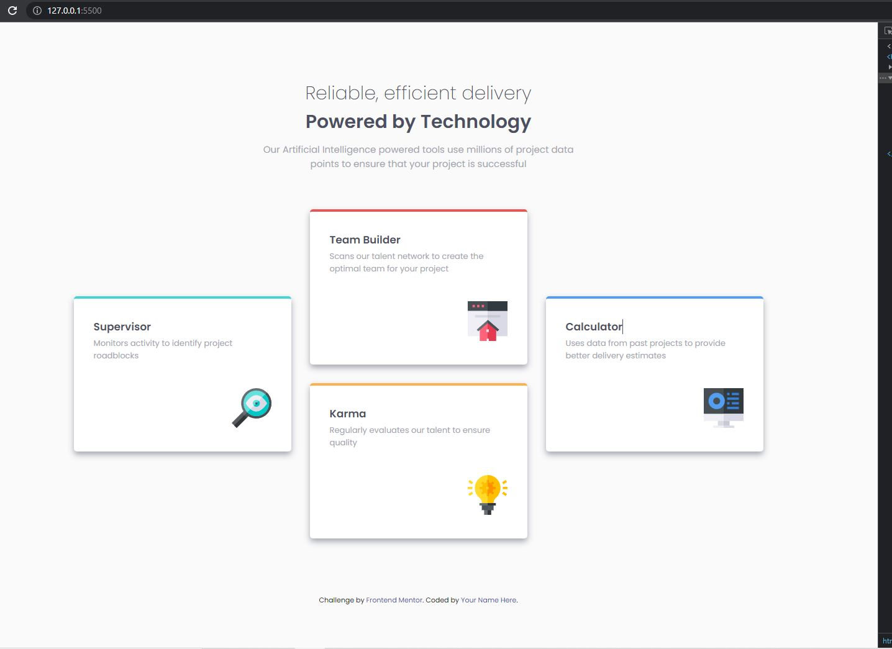

# Frontend Mentor - Four card feature section solution

This is a solution to the [Four card feature section challenge on Frontend Mentor](https://www.frontendmentor.io/challenges/four-card-feature-section-weK1eFYK). Frontend Mentor challenges help you improve your coding skills by building realistic projects. 

## Table of contents

- [Overview](#overview)
  - [The challenge](#the-challenge)
  - [Screenshot](#screenshot)
  - [Links](#links)
- [My process](#my-process)
  - [Built with](#built-with)
  - [What I learned](#what-i-learned)
  - [Useful resources](#useful-resources)
- [Author](#author)
- [Acknowledgments](#acknowledgments)

## Overview

### The challenge

Users should be able to:

- View the optimal layout for the site depending on their device's screen size

### Screenshot

### Links

- Solution URL: [Frontedmentor Challenge Page](https://your-solution-url.com)
- Live Site URL: [Git Pages](https://marcioufrj.github.io/challenge-newbie-four-card-feature-section/)

## My process

1. Completed desktop version.
2. Completed mobile version.

### Built with

- Semantic HTML5 markup
- CSS custom properties
- Flexbox
- CSS Grid

### What I learned

- Better understanding of CSS Position, CSS Border and CSS Flexbox

### Useful resources

- [CSS Tricks - Flexbox](https://css-tricks.com/snippets/css/a-guide-to-flexbox/)

## Author

- Frontend Mentor - [@marcioUfrj](https://www.frontendmentor.io/profile/marcioUfrj)
- Twitter - [@tsukimi_23](https://www.twitter.com/tsukimi_23)